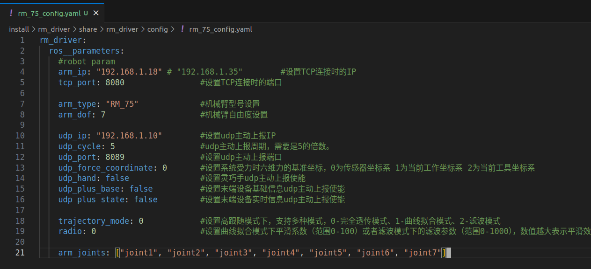
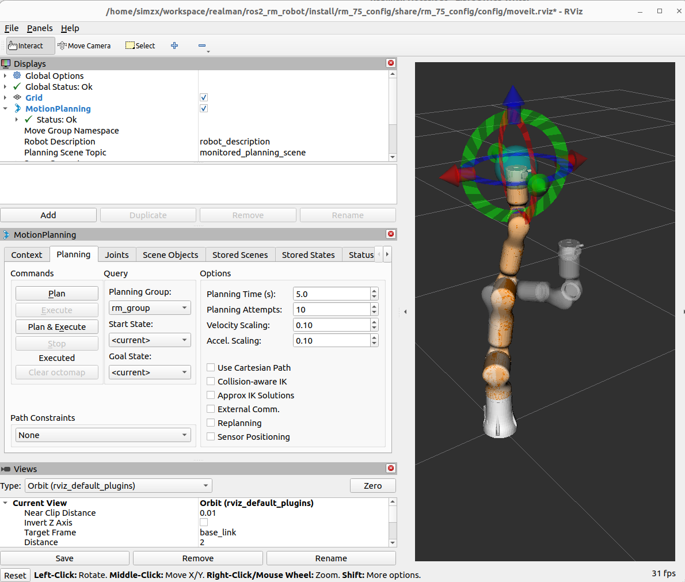

# RealMan Robot Setup and Control Guide

## 1. Connect RM Robot

Clone the RealMan ROS2 repository:
```bash
git clone https://github.com/RealManRobot/ros2_rm_robot
```

**Important**: Use the humble branch: https://github.com/RealManRobot/ros2_rm_robot/tree/humble

## 2. IP Configuration

- **Default RealMan IP**: `http://192.168.1.18/`
- Check your IP configuration (row 4 in the network settings)
- **Critical**: Different IP addresses will cause connection failures
- 

## 3. Launch RVIZ and Gazebo (Simulation)

Start the simulation environment:
```bash
ros2 launch rm_bringup rm_75_gazebo.launch.py
```

### Commands for Moving RM Robot in Gazebo

#### Single Position Movement
```bash
ros2 topic pub --once /rm_group_controller/joint_trajectory trajectory_msgs/msg/JointTrajectory '{
joint_names: ["joint2", "joint3", "joint5", "joint6", "joint1", "joint4", "joint7"],
points: [{
positions: [-0.1, 0.15797558348044038, 0.03878517135049275, -1.073140590623038, 0.19351433116340555, 1.2890189045421092, -0.3663356295748468],
time_from_start: {sec: 3, nanosec: 0}
}]
}'
```

#### Multi-Point Trajectory Movement
```bash
ros2 topic pub --once /rm_group_controller/joint_trajectory trajectory_msgs/msg/JointTrajectory '{
joint_names: ["joint2", "joint3", "joint5", "joint6", "joint1", "joint4", "joint7"],
points: [
{
positions: [0.2, 0.2, 0.1, -0.5, 0.3, 1.0, -0.2],
time_from_start: {sec: 2, nanosec: 0}
},
{
positions: [0.5, 0.4, 0.2, -0.8, 0.6, 1.2, -0.1],
time_from_start: {sec: 4, nanosec: 0}
},
{
positions: [0.0, 0.0, 0.0, -0.3, 0.0, 0.8, 0.0],
time_from_start: {sec: 6, nanosec: 0}
}
]
}'
```
- 

## 4. Connect Physical Robot

Launch the real robot driver:
```bash
cd ~/workspace/realman/ros2_rm_robot
ros2 launch rm_bringup rm_75_bringup.launch.py
```

### Physical Robot Control Commands

#### Cartesian Position Movement (movej_p)
```bash
ros2 topic pub --once /rm_driver/movej_p_cmd rm_ros_interfaces/msg/Movejp "{
pose: {
position: {x: 0.3, y: 0.0, z: 0.5},
orientation: {x: 0.0, y: 0.0, z: 0.0, w: 1.0}
},
speed: 10,
trajectory_connect: 0,
block: true
}"
```

#### Joint Space Movement (movej)
```bash
ros2 topic pub --once /rm_driver/movej_cmd rm_ros_interfaces/msg/Movej "{
joint: [0.0, 0.0, 0.0, 0, 0.0, 0, 0.0],
speed: 10,
block: true,
dof: 7
}"
```

## 5. Circular Motion (movec)

### Message Structure
```bash
ros2 interface show rm_ros_interfaces/msg/Movec
```

**Output:**
```
geometry_msgs/Pose pose_mid
    Point position
        float64 x
        float64 y
        float64 z
    Quaternion orientation
        float64 x 0
        float64 y 0
        float64 z 0
        float64 w 1
geometry_msgs/Pose pose_end
    Point position
        float64 x
        float64 y
        float64 z
    Quaternion orientation
        float64 x 0
        float64 y 0
        float64 z 0
        float64 w 1
uint8 speed
uint8 trajectory_connect
bool block
uint8 loop
```

### Example movec Command
```bash
ros2 topic pub --once /rm_driver/movec_cmd rm_ros_interfaces/msg/Movec "{
pose_mid: {
position: {x: 0.25, y: 0.05, z: 0.4},
orientation: {x: 0.0, y: 0.0, z: 0.0, w: 1.0}
},
pose_end: {
position: {x: 0.25, y: -0.05, z: 0.4},
orientation: {x: 0.0, y: 0.0, z: 0.0, w: 1.0}
},
speed: 10,
trajectory_connect: 0,
block: true,
loop: 0
}"
```

## Notes

- **Joint Order**: Note that the joint order in trajectory messages is: `["joint2", "joint3", "joint5", "joint6", "joint1", "joint4", "joint7"]`
- **Coordinates**: Position units are in meters, orientation uses quaternions
- **Speed**: Speed values are typically 1-100 (percentage)
- **Block**: Set to `true` for blocking (wait for completion) or `false` for non-blocking
- **Loop**: For movec, specifies number of circular loops to execute

## Troubleshooting

1. **Connection Issues**: Verify IP address matches robot configuration
2. **Movement Failures**: Check joint limits and workspace boundaries
3. **Simulation vs Real**: Different topic names for simulation (`/rm_group_controller/`) vs real robot (`/rm_driver/`)